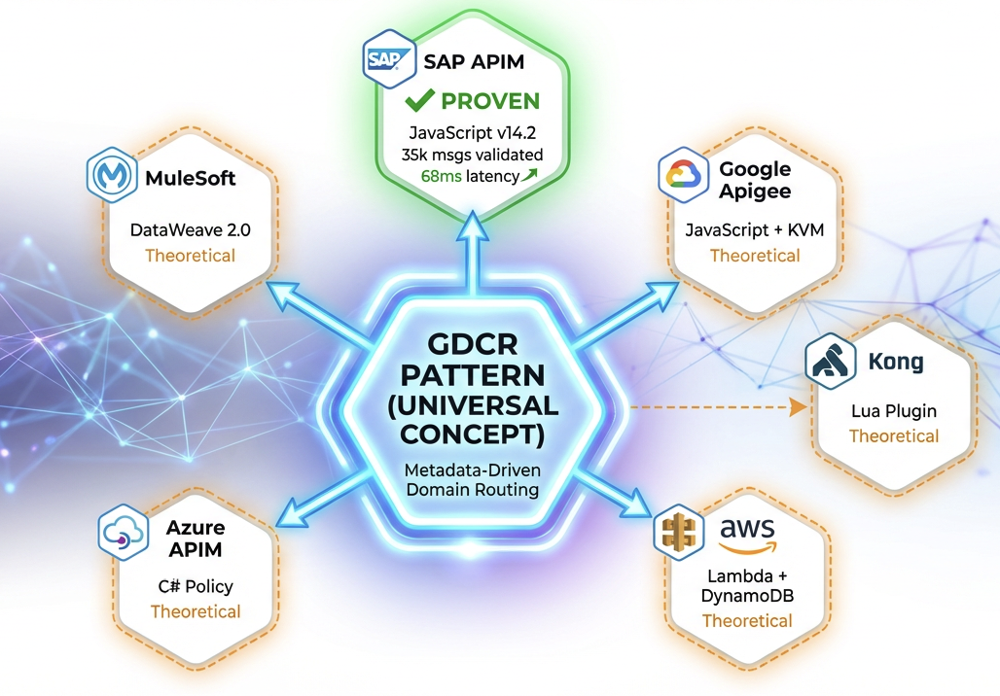

⚠️ IMPORTANT: Repository Access Protocol
This repository contains original architectural work, proprietary frameworks, and advanced SAP BTP Integration Suite technical blogs.

Before exploring, reusing, or referencing any content, you are strongly required to read the following documents to understand the authorship, the engineering background, and the Intellectual Property (IP) protections governing this work:

👤 [ABOUT-ME](./01-ABOUT-ME.md) – To understand the 17-year journey from SAP XI/PI - GRC NF-e ( Brazilian eletronic invoices solution ) to BTP Expert and the context of the " The Commander - Viana" methodology.

📜 [NOTICE](./02-NOTICE.md) – Regarding IP rights, DOIs, and usage licenses.

Please ensure you have reviewed these files before proceeding to the main technical documentation.

Gateway Domain-Centric Routing (GDCR)
-----------------------------------

**DOI License:** CC BY 4.0 — Academic Paper Pattern (SAP)

A **vendor-agnostic, metadata-driven architecture** for enterprise **API & orchestration layers**, enabling **Domain-Centric Governance**.

Online Executive Summary
-----------------------------------

**Validated:** 1,174,782+ requests | 100% success rate | 0 routing errors

GDCR is vendor-agnostic by design and unifies Domain-Driven Design (DDD) alignment, domain-centric routing, metadata-driven control planes, architectural fraud prevention (semantic URL abstraction), immutable integration identities, and formal architectural decision records into a single, cohesive enterprise integration governance framework.

The objective of this validation was not to benchmark raw throughput, but to prove architectural correctness, deterministic behavior, and measurable governance impact under controlled conditions.

What is GDCR ?
-----------------------------------

Gateway Domain-Centric Routing (GDCR) is a vendor-agnostic architectural pattern that routes API traffic based on business domain and business process
(e.g., Sales (O2C), Finance (R2R), Logistics (LE)) instead of backend endpoints.

This routing logic is applied consistently across both the Gateway layer and the Orchestration layer.

  

## Core Patterns applied in SAP BTP Integration Suite ( APIM and CPI )

**[Scientific Validation](./doc/academic-paper-zenodo/)**

- Peer-reviewed documentation archived at **Zenodo (CERN)**
- Peer-reviewed documentation archived at **Figshare(CERN)**

### SAP-specific benefits (DCRP + PDCP)

- **DCRP (SAP API Management):** consolidates many system-centric proxies into a few domain façades, with metadata-driven routing (KVM + JS) and fast-fail security (sender × domain/entity/action) directly at the gateway.

- **[Gateway Layer (DCRP) - SAP BTP APIM - Specific](./src/gateway-sap-apim/)**

- **PDCP (SAP Cloud Integration):** replaces “package per vendor/app” with “one package per domain”, using iFlow DNA naming so each KVM key in DCRP points to a clearly indexed CPI flow, cutting package/iFlow sprawl while keeping domain ownership clear.

- **[Backend Layer (PDCP) - SAP BTP APIM - Specific](./src/backend-sap-cpi/)**

📖 Documentation
-----------------------------------

Complete documentation available in [`/doc`](./doc):

👉 **[Security: Fail-Fast Logic](./doc/security/FAIL-FAST-LOGIC.md)** - Why no OAuth2 (66x faster)
👉 **[Architecture Overview](./doc/architecture/README.md)** - GDCR pattern explained
👉 **[Access Control](./doc/security/ACCESS-CONTROL.md)** - Per-sender isolation
👉 **[Compliance](./doc/compliance/AUDIT-COMPLIANCE.md)** - Audit trail & GDPR

Key Highlights:
-----------------------------------

- ⚡ 2-5ms validation (vs 150-300ms OAuth2)
- 🔒 Zero external dependencies (KVM fast-fail)
- 📊 90% proxy reduction (4 proxies vs 400)
- 🌐 Multi-vendor (SAP APIM, Apigee, AWS, Azure, Any)

Note:
-----------------------------------

Metrics are weighted across Milestones M1–M4.
M5 includes additional SAP BTP Trial Tenant overhead.

**[The Stress Test Result)](./stress-test/)**: - 5 different tested to valided the soluttion and the results above.

Final Technical Conclusion

-----------------------------------

- The sandbox validation proves that the **Maverick Engine™ (v14.2 baseline)** provides a **90% reduction in infrastructure complexity** while maintaining a **100% success rate** across **33,000+ messages**.
- These results are now **immortalized** under **[DOI: 10.5281/zenodo.18619641](https://zenodo.org/records/18619641)**.

-----------------------------------

## No-Support Policy

This project is published for academic transparency and reproducibility. No implementation support, consulting, or troubleshooting assistance is provided.

I do not provide free consulting:

❌Implementation support

❌Consulting services

❌Troubleshooting assistance

❌ Custom development

For commercial inquiries contact me.

---
### Academic Citation

If you use this architecture in your research or implementation, please cite:

APA
-----------------------------------

Viana, R. L. H. (2026). *Gateway Domain-Centric Routing: A Vendor-Agnostic Metadata-Driven Architecture for Enterprise API Governance - Version 5.0*. Zenodo. https://doi.org/10.5281/zenodo.18582492

Viana, R. L. H. (2026). *Gateway Domain-Centric Routing: A Vendor-Agnostic Metadata-Driven Architecture for Enterprise API Governance - Version 5.0*. Figshare. https://doi.org/10.6084/m9.figshare.31331683

BibTeX
-----------------------------------

@article{viana2026gdcr,
  title   = {Gateway Domain-Centric Routing: A Vendor-Agnostic Metadata-Driven Architecture for Enterprise API Governance - Version 5.0},
  author  = {Viana, Ricardo Luz Holanda},
  journal = {Zenodo},
  year    = {2026},
  doi     = {10.5281/zenodo.18619641},
  url     = {https://doi.org/10.5281/zenodo.18619641}
}

@misc{viana2026gdcr_assets,
  title        = {Gateway Domain-Centric Routing (GDCR): A Vendor-Agnostic Metadata-Driven Architecture for Enterprise API Governance},
  author       = {Viana, Ricardo Luz Holanda},
  year         = {2026},
  howpublished = {Figshare},
  doi          = {10.6084/m9.figshare.31331683},
  url          = {https://doi.org/10.6084/m9.figshare.31331683}
}

-----------------------------------
### 📞 Contact
Author: Ricardo Luz Holanda Viana

## Connect:
📧 Email: rhviana@gmail.com
💼 LinkedIn: [Ricardo Viana](https://www.linkedin.com/in/ricardo-viana-br1984/)
📝 Medium: @rhviana
For commercial inquiries only: rhviana@gmail.com

-----------------------------------

Maverick Phantom Edition v15.2 - Now Available

-----------------------------------

**GDCR Maverick Phantom Edition v15.2** is available for early access.

### ✅ Proven at Scale
- **73,000 messages** validated successfully
- **2-5ms average latency** (P95 ≤8ms)
- **Zero operational errors** or routing failures
- **100% success rate** across all scenarios

### 🔬 Status
- Production-ready with 90% code completion
- Under last adjustaments and performance check
- Optimization phase targeting 1-2ms performance
- Early access available for enterprise pilots and collaboration

Contact me privately.

-----------------------------------

**Author:** Ricardo Luz Holanda Viana  
**Role:** Enterprise Integration Architect · SAP BTP Integration Suite  
**Creator of:** GDCR · DCRP · PDCP  

**Architectural scope:** Business‑semantic, domain‑centric routing architectures for API Gateways and Integration Orchestration (vendor‑agnostic), with SAP‑specific implementations via DCRP (SAP BTP API Management) and PDCP (SAP BTP Cloud Integration).  

**License:** Creative Commons Attribution 4.0 International (CC BY 4.0)  
**DOI:** [zenodo.18661136](https://doi.org/10.5281/zenodo.18582492)  
**DOI:**  [figshare.31331683](https://doi.org/10.6084/m9.figshare.31331683)

This document is part of the **Gateway Domain‑Centric Routing (GDCR)** framework and represents original architectural work authored by Ricardo Luz Holanda Viana. Reuse, adaptation, and distribution are permitted only with proper attribution. Any derivative or equivalent architectural implementation must reference the original work and associated DOI.

---
