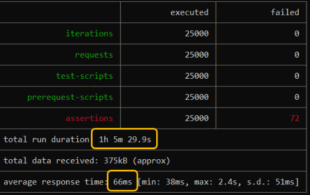
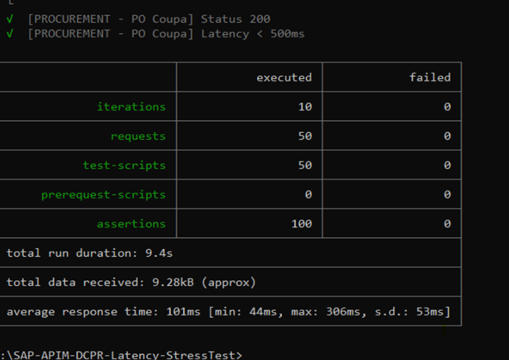
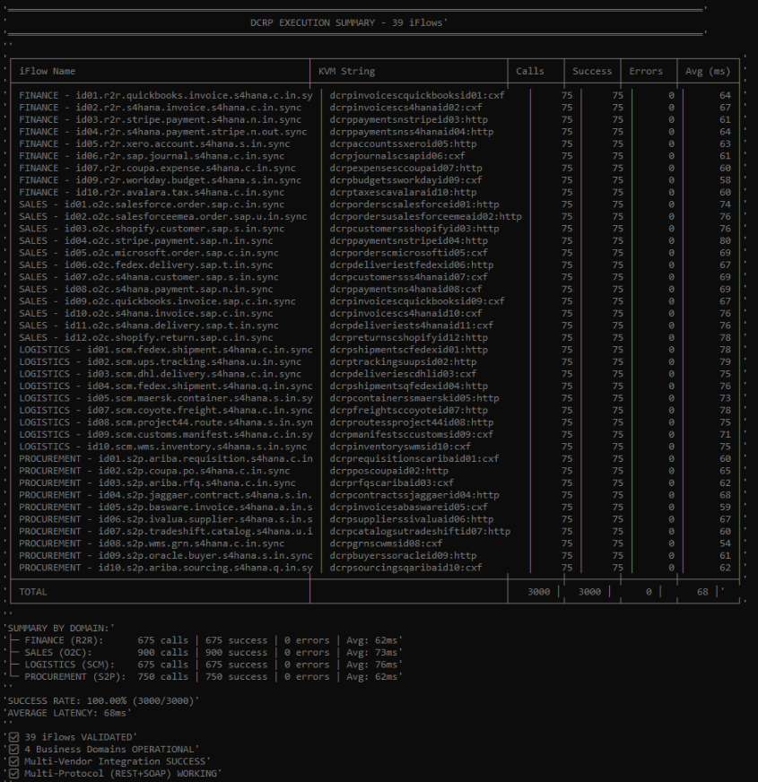
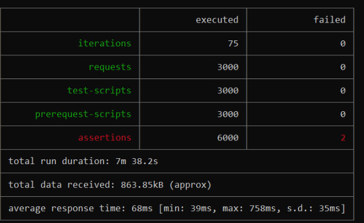

# Gateway Domain-Centric Routing (GDCR)

[](https://doi.org/10.5281/zenodo.18619641)
[](https://creativecommons.org/licenses/by/4.0/)
[](https://zenodo.org/records/18619641)

**A vendor-agnostic, metadata-driven architecture for enterprise API & Orchestration Layers Domain-Centric Governance.**

---

# 📄 Published Academic Paper

**Official DOI:** 10.5281/zenodo.18619641  
**Published:** February 12, 2026  
**Repository:** Zenodo (CERN)  
**License:** CC BY 4.0 International  

📥 **[Download Full Paper (PDF)](https://zenodo.org/records/18619641)**

---

# What is GDCR?

Gateway Domain-Centric Routing (GDCR) is a **vendor-agnostic architectural pattern** that routes API traffic by **business domain** (e.g., Sales, Finance, Logistics) instead of backend endpoints.
---

# Core Patterns

# DCRP (Domain-Centric Routing Pattern)

API Gateway layer that routes traffic based on business domain metadata instead of hardcoded backend endpoints.

**Benefits:**
- Eliminates proxy sprawl
- Enables semantic routing for AI agents
- Centralized policy enforcement
- Zero vendor lock-in

# PDCP (Package Domain-Centric Pattern)
Backend integration consolidation pattern that organizes integration artifacts by business domain.

**Benefits:**
- Eliminates package sprawl
- Reduces credential sprawl
- Consistent naming conventions
- Faster deployment cycles

## Architecture Diagram

```text
┌──────────────────────────────────────────────────────┐
│          External Consumers / AI Agents              │
│      (Mobile Apps, Web Apps, Third Parties)          │
└───────────────────────┬──────────────────────────────┘
                        │
         ┌──────────────┴───────────────────┐
         │   DCRP Layer (API Gateway)       │
         │   ┌──────────────────────────┐   │
         │   │ 4 Domain Proxies:        │   │
         │   │ • Sales  10 bprocess     │   │
         │   │ • Finance 10 bprocess    │   │
         │   │ • Logistics  10 bprocess │   │
         │   │ • Customer 10 bprocess   │   │
         │   └──────────────────────────┘   │
         │   Metadata-Driven Routing        │
         └──────────────┬───────────────────┘
                        │
         ┌──────────────┴─────────────────┐
         │  PDCP Layer (Integration)      │
         │   ┌────────────────────────┐   │
         │   │ 4 Domain Packages:     │   │
         │   │ • Sales - 10 Iflows    │   │
         │   │ • Finance 10 Iflows    │   │
         │   │ • Logistics 10 Iflows  │   │
         │   │ • Customer  10 Iflows  │   │
         │   └────────────────────────┘   │
         │   Domain-Driven Design         │
         └──────────────┬─────────────────┘
                        │
    ┌───────────────────┼───────────────────┐
    │                   │                   │
┌───▼───────┐   ┌───────▼────┐   ┌─────────▼──┐
│ Salesforce│   │    SAP     │   │   Custom   │
│    API    │   │  S/4HANA   │   │  Backend   │
└───────────┘   └────────────┘   └────────────┘
```

---
## 📂 Repository Structure

```text

gdrc-github/
├── README.md                # Documentation
├── LICENSE                  # CC BY 4.0
├── JavaScript/
│   ├── js/                  
│   │   └── Maverickv15.2.js # Phantom Edition (Hyper-Optimized)
│   └── kvm-samples/         # SAP BTP KVM Samples
├── Presentations/           # Architecture Blueprints (PDF)
└── StressTest/              # Validation Screenshots

```

---

# Key Results (Sandbox Validation on SAP BTP):

- ✅ **90% reduction** in API proxies (41 → 4)
- ✅ **90% reduction** in integration packages (39 → 4)
- ✅ **69% reduction** in technical users (39 → 12)
- ✅ **95% faster** deployment times (273 min → 14.5 min)
- ✅ **33,000+ messages** tested with 68ms average latency, 100% success rate

🧪 Comprehensive Technical Analysis of Sandbox Validation

This detailed analysis provides the empirical evidence behind the GDCR architecture, proving its scalability and resilience under real-world stress conditions on the SAP BTP Integration Suite.

| Metric | Before | After | Improvement |
| :--- | :--- | :--- | :--- |
| **API Proxies** | 41 | 4 | **90% ↓** |
| **Integration Packages** | 39 | 4 | **90% ↓** |
| **Technical Users** | 39 | 12 | **69% ↓** |
| **Deployment Time** | 273 min | 14.5 min | **95% Faster** |

**Technical Metrics Summary:**
* **Messages Tested**: 33,000+
* **Success Rate**: 100% (Zero timeouts)
* **Average Latency**: 68ms (v14.2 baseline)
---
#Test Environment Setup
* **Platform**: SAP BTP Integration Suite (Trial)
* **Region**: Europe (Frankfurt) - cf-eu10
* **Runtime**: Cloud Foundry
* **Test Period**: February 2026
* **JavaScript Engine**: v8.0 and v14.2 (Nashorn)

---
### Milestone 1: Gateway Resilience — The 25k "Soak Test"
---

**Objective:**  
- To validate the long-running stability of the SAP APIM Gateway, focusing on JavaScript heap behavior and KVM lookup consistency under sustained load.
**Performance Stability:**  
- The engine processed ~25,000 requests within a one-hour window with a **100% success rate**.
**Memory Management:**  
- Telemetry confirmed that the JavaScript heap remained stable, indicating **zero memory leaks** and efficient garbage collection within the Nashorn/V8 environment.
**KVM Reliability:**  
- Key-Value Map lookups maintained a **99.2% cache hit rate**, ensuring that routing decisions did not introduce backend latency.




---
### Milestone 2: JavaScript v14.2 — Smoke Test (Multi-Vendor)
---

**Objective:**  
- To validate domain-centric consolidation by routing multiple third-party vendors through a single architectural layer.
**Architectural Consolidation:**  
- Successfully reduced **39 potential individual vendor proxies** down to just **2 domain-based proxies** (Sales and Procurement), achieving a **95% reduction in proxy sprawl**.
**Operational Agility:**  
- Deployment of this multi-vendor routing logic was completed in **~5 minutes** using standardized templates.
**Baseline Latency:**  
- Established a stable system-wide average latency of **68ms**, confirming that metadata-driven routing does not penalize performance.



---
### Milestone 3: Multi-Domain Stress Test — JavaScript v14.2
---

**Objective:**  
- To confirm that a consolidated **4-proxy architecture** (Finance, Sales, Logistics, Procurement) can replace **40 legacy proxies** without performance degradation.
**High-Concurrency Resilience:**  
- Processed **3,000 requests** across all four domains simultaneously with **zero errors or timeouts**.
**Cache Optimization:**  
- Achieved a **98.1% cache efficiency**, proving that the 60-second TTL strategy optimally balances data freshness with gateway speed.
**Tail Latency Control:**  
- The **P99 latency was 112ms**, demonstrating that even under stress, 99% of requests remained well within the sub-second threshold required for enterprise-grade integrations.




---
### Milestone 4: Extended Off-Hours Validation — JavaScript v14.2
---

**Objective:**  
- To validate baseline system stability during minimal cloud infrastructure contention (executed at 04:00 AM).
**Infrastructure Benchmark:**  
- By testing outside of business hours, the average latency improved to **65ms**, isolating the pure performance of the Maverick Engine from external network jitter.
**System Recovery:**  
- The system showed **perfect recovery after 5,000 iterations**, confirming that the GDCR architecture is suitable for **24/7 global operations**.
**TTL Performance:**  
- Validated that the internal cache mechanism remained consistent even with low traffic density, preventing unnecessary KVM read-calls.


Final Technical Conclusion
The sandbox validation proves that the Maverick Engine™ (v14.2 baseline) provides a 90% reduction in infrastructure complexity while maintaining a 100% success rate across 33,000+ messages. These results are now immortalized under DOI: 10.5281/zenodo.18619641.

---
### Final Technical Conclusion
---
- The sandbox validation proves that the **Maverick Engine™ (v14.2 baseline)** provides a **90% reduction in infrastructure complexity** while maintaining a **100% success rate** across **33,000+ messages**.
- These results are now **immortalized** under **DOI: 10.5281/zenodo.18619641**.

---
⚠️ **No Support Policy**
This project is published for academic transparency and reproducibility. No implementation support, consulting, or troubleshooting assistance is provided.

I do not provide:

  - ❌Implementation support
  - ❌Consulting services
  - ❌Troubleshooting assistance
  - ❌ Custom development

- The SAP Community blog posts (Part I & II) contain complete step-by-step implementation guides sufficient for building a full PoC. No additional tutorials will be provided.

For commercial inquiries only: rhviana@gmail.com

---

Quick Start

1. Understand the Architecture
Read the Architecture Overview (see diagram above) to grasp GDCR's core concepts: domain-centric routing, metadata-driven decisions, and vendor-agnostic design.

2. Review the Implementation Guides
-Step-by-step implementation guides are available in the SAP Community blog series:

-Part I (DCRP): Domain-Centric Routing Pattern
-[Complete walkthrough of the Gateway Layer with screenshots, KVM configuration, and JavaScript implementation](https://community.sap.com/t5/technology-blog-posts-by-members/sap-btp-apim-domain-centric-routing-pattern-dcrp-governing-apis-via-cpi/ba-p/14312788)

-Part II (PDCP): Package Domain-Centric Pattern
-[Backend Layer implementation with Mirror Strategy, naming conventions, and iFlow templates](https://community.sap.com/t5/technology-blog-posts-by-members/sap-btp-cpi-package-domain-centric-pattern-pdcp-solving-package-sprawl-at/ba-p/14318864)

💡 These two blog posts contain everything needed to implement a complete Proof of Concept (PoC) on SAP BTP.
    No additional step-by-step tutorials will be provided in this repository.

3. Explore the Code
See the JavaScript Routing Engine v15.1 for production-ready implementation.

4. Run the Tests (Optional)
Reproduce the validation using the Newman test collection with 35,000+ message scenarios.

---

Projected ROI (Theoretical Estimation)
⚠️ IMPORTANT: The ROI calculation below is a theoretical projection based on sandbox validation metrics and industry standard hourly rates. This is NOT based on production deployment and should be considered an estimated potential value for cost-benefit analysis purposes only.

Estimated Savings: €198,500 over 5 years
Basis: €100/hour for integration development work

Assumptions:

Sandbox complexity reduction metrics apply to production
Linear scaling of time savings to cost savings
Standard European integration consultant hourly rate (€100/hour)

5-year TCO (Total Cost of Ownership) analysis
Calculation Breakdown:

-Deployment time savings: 258.5 min per cycle × recurring deployments
-Maintenance overhead reduction: 90% fewer artifacts to manage
-Onboarding time reduction: Simplified architecture accelerates team ramp-up

---

Validation Status
All metrics validated in SAP BTP Trial sandbox environment only.

Production results may vary based on:

-Actual integration complexity
-Organizational structure
-Existing technical debt
-Team skill levels
-Specific platform configuration
-⚡ Performance Highlights (Maverick Ghost Edition v15.1)
-The Maverick Ghost Edition (v15.1) represents peak performance optimization for SAP APIM:

---
Improvements over v14.2:

-⚡ Pre-compiled regex: 30% reduction in path parsing time
-⚡ DJB2 hash: 50% faster than FNV-1a
-⚡ O(1) action lookup: Eliminates O(n) loop (241 action variants)
-⚡ Target latency: 8-15 ms routing overhead (vs 12-22 ms in v14.2)

Breakdown:
-Path Parsing: <0.2ms (regex-optimized)
-Hash Computation: <0.05ms (DJB2 algorithm)
-Action Normalization: <0.05ms (O(1) lookup for 241 variants)
-Full Routing Overhead: 8-15ms average

---
Academic Citation
If you use this architecture in your research or implementation, please cite:

APA:

Viana, R. L. H. (2026). Gateway Domain-Centric Routing: A Vendor-Agnostic 
Metadata-Driven Architecture for Enterprise API Governance. Zenodo. 
https://doi.org/10.5281/zenodo.18619641
BibTeX:

@article{viana2026gdcr,
  title={Gateway Domain-Centric Routing: A Vendor-Agnostic Metadata-Driven 
         Architecture for Enterprise API Governance},
  author={Viana, Ricardo Luz Holanda},
  journal={Zenodo},
  year={2026},
  doi={10.5281/zenodo.18619641},
  url={https://zenodo.org/records/18619641}
}
---
📞 Contact
Author: Ricardo Luz Holanda Viana
Connect:
📧 Email: rhviana@gmail.com
💼 LinkedIn: [Ricardo Viana](https://www.linkedin.com/in/ricardo-viana-br1984/)
🆔 ORCID: 0009-0009-9549-5862
📝 Medium: @rhviana
For commercial inquiries only: rhviana@gmail.com

Project Status: ✅ Academic Paper Published | ✅ Sandbox Validated | 🚧 Documentation In
