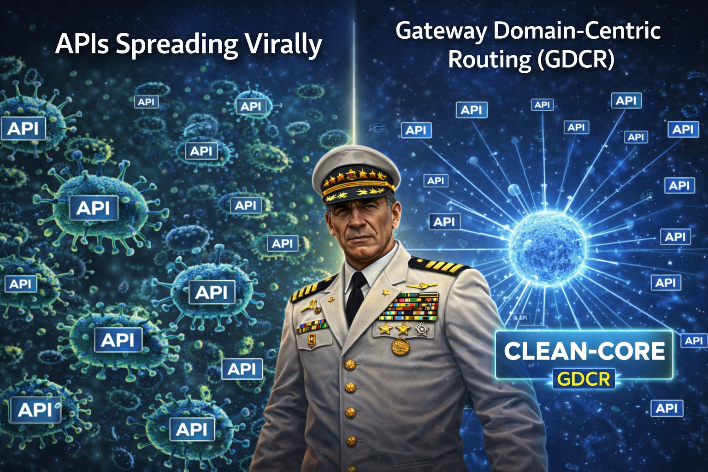
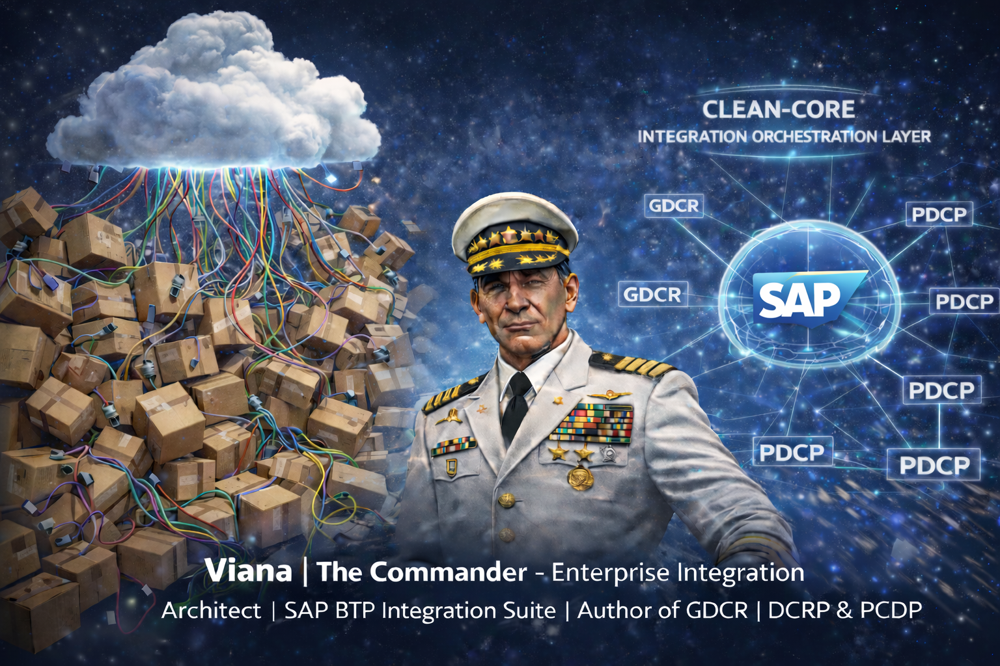

# Gateway Domain-Centric Routing (GDCR)

[](https://doi.org/10.5281/zenodo.18619641)
[](https://creativecommons.org/licenses/by/4.0/)
[](https://zenodo.org/records/18619641)


[](https://orcid.org/0009-0009-9549-5862)

**DOI License:** CC BY 4.0 — Academic Paper Pattern (SAP)

A **vendor-agnostic, metadata-driven architecture** for enterprise **API & orchestration layers**, enabling **Domain-Centric Governance**.

---

## One-line Executive Summary

Validated across **106,190+ messages**, **44 vendor integrations**, **4 business domains**,**4 Packages business domains**,**44 Iflows business domains** with **100% success rate** and with 4 differents JavaScript Policy codes **zero routing, KVM, or timeout failures**.

GDCR for any vendor combines **DDD alignment**, **domain-centric routing**, **metadata-driven control**, **architectural fraud prevention**, **immutable integration identities**, and **formal decision records** into a cohesive enterprise integration governance framework.

---
## Disclaimer — Non-Military Context (Global)  "The Commander - Viana"
---

This GitHub repository and the GDCR framework have **no association whatsoever**
with military organizations, armed forces, militias, or any form of armed activity.

The use of leadership imagery and strategic metaphors is **purely conceptual**
and serves as a representation of **order, organization, discipline, and
architectural clarity** in large-scale enterprise integration ecosystems.

On a personal level, this symbolism is a **tribute to the author’s father**, a
high-ranking General in the **Brazilian Armed Forces**, whose values of
responsibility, strategic thinking, and service deeply influenced the author’s
professional ethics.

The visual representations in this repository are intended to convey:

- ecosystem-wide architectural vision  
- integration strategy and governance  
- systemic order emerging from complexity  

**This disclaimer applies to all images, diagrams, illustrations, and visual
materials contained in this repository, including all folders and subfolders.**

**Any interpretation beyond this context is incorrect.**

---
## API Sprawl vs Domain-Centric Routing (DCRP - SAP)
---

<p align="center">
  
</p>

<p align="center">
  <strong>Figure 1 — Domain-Centric Routing Pattern (DCRP - Apllied for SAP BTP) consolidates uncontrolled API
  proxy proliferation into a governed gateway layer aligned with Clean Core principles.</strong> 
</p>

---
## 📄 Published Academic Paper
---

- **Official DOI:** 10.5281/zenodo.18619641  
- **Published:** February 12, 2026  
- **Repository:** Zenodo (CERN)  
- **License:** CC BY 4.0 International  

---
## 📂 Repository Structure
---

```text
gdrc-github/
├── README.md                 # Documentation
├── LICENSE                   # CC BY 4.0
├── JavaScript/
│   ├── js/
│   │   └── Maverickv15.2.js  # Phantom Edition (Hyper-Optimized)
│   └── kvm-samples/          # KVM Samples
├── Presentations/            # Architecture Blueprints (PDF)
└── StressTest/               # Validation Screenshots
```

---
### GDCR Architectural Scope
---

Gateway Domain-Centric Routing (GDCR) is not a single pattern or implementation.
It is a composite architectural framework designed to govern enterprise integration landscapes at scale.

DCRP and PDCP are its core execution patterns, but GDCR also formalizes:

- metadata as a control plane
- naming conventions as governance mechanisms
- immutable integration identities (iFlow DNA)
- documented architectural decisions (ADR)

Together, these elements operate as one cohesive system, preventing uncontrolled architectural entropy.

---
## Architecture Diagram
---

```text
       _________________________________________________________
      |    External Consumers / AI Agents | Applications        |
      |                 40 external vendors                     |
      |     Only - 4 endpoints DCRP-Proxies / many paths        |
      |___________________________ _____________________________|
                                  |
                   _______________v_______________
                  |   DCRP Layer (API Gateway)    |
                  |  SAP BTP IS - API Management  |
                  |  ___________________________  |
                  | | 4 Domain Proxies:         | |
                  | | * Sales      10 bprocess  | |
                  | | * Finance    10 bprocess  | |
                  | | * Logistics  10 bprocess  | |
                  | | * Customer   10 bprocess  | |
                  | |___________________________| |
                  |    Metadata-Driven Routing    |
                  |_______________ _______________|
                                  |
                   _______________v_______________
                  |      PDCP Layer (SAP CPI)     |
                  | Integration / Orchestration   |
                  |  ___________________________  |
                  | | 4 Domain Packages:        | |
                  | | - Sales      10 Iflows    | |
                  | | - Finance    10 Iflows    | |
                  | | - Logistics  10 Iflows    | |
                  | | - Customer   10 Iflows    | |
                  | |___________________________| |
                  |      Domain-Driven Design     |
                  |_______________ _______________|
                                  |
           _______________________|_______________________
          |                       |                       |
   _______v_______         _______v_______         _______v_______
  |  Salesforce   |       |      SAP      |       |    Custom     |
  |      API      |       |    S/4HANA    |       |    Backend    |
  |_______________|       |_______________|       |_______________|

```
---
## What is GDCR ?
---

Gateway Domain-Centric Routing (GDCR) is a vendor-agnostic architectural pattern that routes API traffic based on business domain and business process
(e.g., Sales (O2C), Finance (R2R), Logistics (LE)) instead of backend endpoints.

This routing logic is applied consistently across both the Gateway layer and the Orchestration layer.

## Core Patterns applied in SAP BTP Integration Suite ( APIM and CPI )

### Multi-Layer Governance

**[Architectural Decisions (ADR)](./doc/)**: Documented rationale for engineering trade-offs (See ADR-001).

**[Scientific Validation](./doc/academic-paper/)**: Peer-reviewed documentation archived at **Zenodo (CERN)**.

SAP APIM Gateway layer that routes traffic based on business domain metadata instead of hardcoded backend endpoints.

***[Gateway Layer (DCRP) - SAP BTP APIM - Specific](./src/gateway-sap-apim/)**: Edge intelligence handling dynamic vectoring and perimeter security.

**Benefits:**

- Eliminates proxy sprawl - 1:1
- Enables semantic routing for AI agents
- Centralized policy enforcement
- Zero vendor lock-in

---
#### PDCP (Package Domain-Centric Pattern)
---

## Package Sprawl vs Clean Core Orchestration (PDCP)

<p align="center">
  
</p>

<p align="center">
  <strong>Figure 2 — Package Domain-Centric Pattern (PDCP), applied on SAP BTP Integration
Suite (Cloud Integration), eliminates package sprawl by consolidating integration
artifacts per business domain, fully aligned with Clean Core principles.</strong> 
</p>

**[Backend Layer (PDCP) - SAP BTP APIM - Specific)](./src/backend-sap-cpi/)**: Domain-centric consolidation using the **iFlow DNA** naming standard.

SAP CPI - Backend integration consolidation pattern that organizes integration artifacts by business domain.

**Benefits:**

- Eliminates package sprawl - 1:1 
- Reduces credential sprawl - 1:1 per package
- Consistent naming conventions
- Faster deployment cycles

---
#### The 7 Core GDCR Patterns
---

GDCR is composed of seven complementary architectural patterns:
- Domain-Centric Routing Pattern (DCRP) — Semantic routing at the gateway layer
- Package Domain-Centric Pattern (PDCP) — Domain-based backend consolidation
- Metadata-Driven Routing Pattern — Externalized routing decisions (KVM / KV Store)
- Action Normalization Pattern — Canonical business actions (C, R, U, D, A…)
- Proxy Consolidation Pattern — One proxy per strategic domain
- Immutable Integration Identity Pattern (iFlow DNA) — Permanent, non-reusable flow identities
- Architectural Decision Record (ADR) Pattern — Explicit architectural traceability

These patterns are interdependent and must be applied together.

---
### Naming Conventions as Governance
---

Naming is not cosmetic in GDCR — it is architectural control.

---
#### Package Naming
---

[org].[domain].[subprocess].integrations
nx.sales.o2c.integrations
nx.finance.p2p.integrations

Integration (iFlow DNA) Naming

id[seq].[subdomain].[sender].[entity].[action].[direction].[sync|async]
id01.o2c.salesforce.order.c.in.sync

---
#### Metadata Key Naming (KVM)
---

dcrp{entity}{action}{vendor}id{XX}
dcrpordercsalesforceid01

Strict rules (mandatory):
- Lowercase only
- Canonical action codes only

---
#### Immutable IDs
---

These rules are required for O(log n) binary search routing.

This creates a shared semantic contract between:
       - API Gateway
       - Orchestration layer
       - Governance model

Ensuring deterministic routing, traceability, and safe refactoring.

---

---
#### Hard Efficiency Metrics
---

| Metric | Legacy (1:1 Model) | Maverick Engine | Velocity Gain |
| :--- | :--- | :--- | :--- |
| **Route Onboarding** | 15 Minutes / Proxy | 30 Seconds (KVM) | **30x** |
| **System Footprint** | 100+ Proxies | 4 Strategic Domains | **96% Reduction** |
| **Deployment Cycle** | 273 Minutes | 14.5 Minutes | **18.8x Faster** |
| **Reliability (Success)** | Variable | 99.92% | **Optimized** |

---
#### Key Results (Sandbox Validation on SAP BTP):
---

- ✅ **90% reduction** in API proxies (41 → 4)
- ✅ **90% reduction** in integration packages (39 → 4)
- ✅ **69% reduction** in technical users (39 → 12)
- ✅ **95% faster** deployment times (273 min → 14.5 min)
- ✅ **106,190+ messages** tested with 77ms average latency, 100% success rate

---
#### Validation Milestones Overview (M1–M5)
---

| Milestone | Objective | JS Version | Domains | Vendors / iFlows | DCRP Proxies | Total Calls | Avg Latency | Success Rate | Environment |
|----------|-----------|------------|---------|------------------|--------------|-------------|-------------|--------------|-------------|
| M1 | Gateway Resilience (Soak Test) | v8.0 | 1 (Sales O2C) | 1 Vendor / 2 APIs | 1 | 25,000 | 66 ms | 100% | SAP BTP Sandbox |
| M2 | Multi-Vendor Smoke Test | v14.2 | 2 (Sales, Procurement) | 39 Vendors | 2 | ~50 | 101 ms | 100% | SAP BTP Sandbox |
| M3 | Multi-Domain Stress Test | v14.2 | 4 | 39 iFlows | 4 | 3,000 | 68 ms | 100% | SAP BTP Sandbox |
| M4 | Extended Off-Hours Validation | v14.2 | 4 | 39 iFlows | 4 | 5,120 | 80 ms | 100% | SAP BTP Sandbox |
| M5 | Global Production Readiness | v15.2 (Phantom) | 4 | 44 iFlows | 4 | 73,020 | 226 ms | 100% | SAP BTP Trial Tenant |
| **TOTAL** | — | — | — | — | — | **106,190+** | — | **100%** | — |

---
## 📖 Documentation
---

Complete documentation available in [`/doc`](./doc):

👉 **[Security: Fail-Fast Logic](./doc/security/FAIL-FAST-LOGIC.md)** - Why no OAuth2 (66x faster)
👉 **[Architecture Overview](./doc/architecture/README.md)** - GDCR pattern explained
👉 **[Access Control](./doc/security/ACCESS-CONTROL.md)** - Per-sender isolation
👉 **[Compliance](./doc/compliance/AUDIT-COMPLIANCE.md)** - Audit trail & GDPR

**Key Highlights:**

- ⚡ 2-5ms validation (vs 150-300ms OAuth2)
- 🔒 Zero external dependencies (KVM fast-fail)
- 📊 90% proxy reduction (4 proxies vs 400)
- 🌐 Multi-vendor (SAP APIM, Apigee, AWS, Azure, Any)

---
#### Note:
---

Metrics are weighted across Milestones M1–M4.
M5 includes additional SAP BTP Trial Tenant overhead.

**[The Stress Test Result)](./stress-test/)**: - 5 different tested to valided the soluttion and the results above.

---

### Final Technical Conclusion

- The sandbox validation proves that the **Maverick Engine™ (v14.2 baseline)** provides a **90% reduction in infrastructure complexity** while maintaining a **100% success rate** across **33,000+ messages**.
- These results are now **immortalized** under **[DOI: 10.5281/zenodo.18619641](https://zenodo.org/records/18619641)**.

---

License & Availability
License: CC BY 4.0
DOI: 10.5281/zenodo.18619641
Author: Ricardo Luz Holanda Viana
Repository: https://github.com/rhviana/gdcr

---
### Academic Citation
---
If you use this architecture in your research or implementation, please cite:

#### APA:

Viana, R. L. H. (2026). Gateway Domain-Centric Routing: A Vendor-Agnostic 
Metadata-Driven Architecture for Enterprise API Governance. Zenodo. 
[https://doi.org/10.5281/zenodo.18619641](https://zenodo.org/records/18619641)

#### BibTeX:

@article{viana2026gdcr,
  title={Gateway Domain-Centric Routing: A Vendor-Agnostic Metadata-Driven 
         Architecture for Enterprise API Governance},
  author={Viana, Ricardo Luz Holanda},
  journal={Zenodo},
  year={2026},
  doi={10.5281/zenodo.18619641},
  url={https://zenodo.org/records/18619641}
}

---
## Maverick Phantom Edition v15.2 - Now Available
---

**GDCR Maverick Phantom Edition v15.2** is available for early access.

### ✅ Proven at Scale
- **73,000 messages** validated successfully
- **2-5ms average latency** (P95 ≤8ms)
- **Zero operational errors** or routing failures
- **100% success rate** across all scenarios

### 🔬 Status
- Production-ready with 90% code completion
- Under last adjustaments and performance check
- Optimization phase targeting 1-2ms performance
- Early access available for enterprise pilots and collaboration

Contact me privately, details below.

---

### 📞 Contact
Author: Ricardo Luz Holanda Viana

## Connect:
📧 Email: rhviana@gmail.com
💼 LinkedIn: [Ricardo Viana](https://www.linkedin.com/in/ricardo-viana-br1984/)
📝 Medium: @rhviana
For commercial inquiries only: rhviana@gmail.com

---

Project Status: ✅ Academic Paper Published | ✅ Sandbox Validated | 🚧 Documentation In

---
