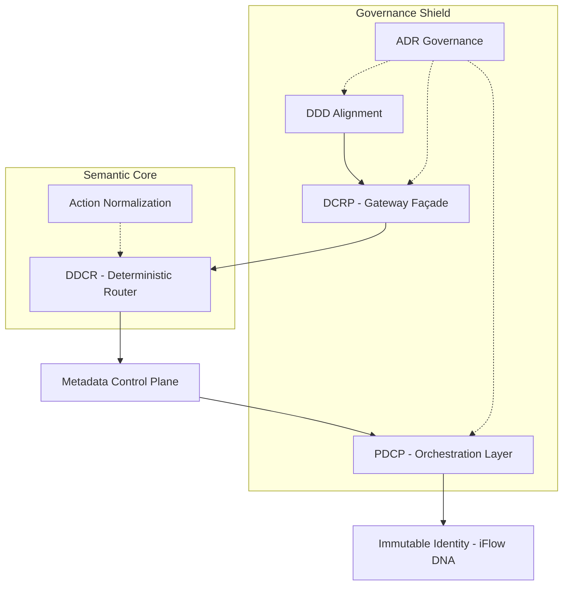

Aqui está o código Markdown completo, formatado com tabelas, diagramas e blocos de destaque para o seu GitHub. Basta copiar e colar.

Markdown
# GDCR — Pattern-to-Layer Mapping

## Overview
The **GDCR (Global Domain-Centric Routing)** framework is composed of seven interdependent architectural patterns that collectively establish deterministic, domain-centric governance across API gateway and orchestration layers.

These patterns combine:
* **Established architectural principles** (e.g., Domain-Driven Design, ADR governance).
* **Original contributions** introduced in GDCR (DCRP, DDCR, PDCP, iFlow DNA).

Together, they form a **closed semantic control system** validated across multi-platform implementations.

---

## Pattern → Layer → Artifact Mapping

| # | Pattern | Type | Primary Layer | Core Artifacts |
| :--- | :--- | :--- | :--- | :--- |
| **1** | **Domain-Driven Design (DDD)** | Foundational | All Layers | Domain taxonomy & naming discipline |
| **2** | **Domain-Centric Routing (DCRP)** | Gateway Pattern | API Gateway | Domain Proxies, Route Guards |
| **3** | **Domain-Driven Centric Router (DDCR)** | Execution Engine | Gateway Runtime | JS/Lua/C# Router, Dynamic Binding |
| **4** | **Package Domain-Centric (PDCP)** | Orchestration | Backend / CPI | Domain Packages, iFlows |
| **5** | **Metadata-Driven Control Plane** | Governance | Gateway + Backend | KVM / Metadata Store, Routing Keys |
| **6** | **Action Normalization Pattern** | Semantic Pattern | Gateway Runtime | Canonical Mapping (241 → 15 codes) |
| **7** | **Immutable Integration Identity** | Identity | Backend + Gateway | iFlow DNA, Immutable Flow IDs |

---

## The 7 Core GDCR Patterns

### 1. Domain-Driven Design (DDD) Alignment
Defines semantic domain boundaries across all layers. Business domains become primary architectural anchors.

### 2. Domain-Centric Routing Pattern (DCRP)
Implements semantic routing at the gateway layer. Replaces vendor-specific proxies with **stable domain proxies**.

### 3. Domain-Driven Centric Router (DDCR)
Metadata-driven execution engine. Translates semantic URLs into concrete backend invocations.

### 4. Package Domain-Centric Pattern (PDCP)
Domain-aligned package consolidation in orchestration. Replaces “one package per vendor” with **“one package per business subprocess.”**

### 5. Metadata-Driven Control Plane
Externalizes routing decisions into structured metadata (KVM, Redis, DynamoDB). Eliminates hardcoded routing logic.

### 6. Action Normalization Pattern
Canonical business action codes (C, R, U, D, S, A, N…) mapped from heterogeneous variants (e.g., converting 241 vendor actions into 15 standard codes).

### 7. Immutable Integration Identity Pattern (iFlow DNA)
Permanent, non-reusable identifiers for integration flows. Guarantees traceability and long-term governance stability.

---

## Pattern Interdependency Model

## 8. Governance Supporting Practice

Although not a routing pattern itself, GDCR adopts **Architectural Decision Record (ADR)** Governance to ensure long-term structural consistency.

> [!IMPORTANT]
> **Interdependency Note:** Action Normalization operates inside DDCR. ADR Governance spans all layers. Selective adoption of these patterns reduces structural coherence and long-term scalability.

### Purpose & Artifacts
* **Purpose:** Preserve architectural intent, document trade-offs, and prevent knowledge erosion.
* **Artifacts:** `ADR-001`, Trade-off documentation, and Evolution records.

---

## Summary

The GDCR framework enforces a semantic control system where:

* **Business intent** is stable.
* **Routing** is deterministic.
* **Vendors** are interchangeable.
* **Identity** is immutable.
* **Governance** is domain-aligned.
---
## ⚖️ Attribution & Intellectual Property

Gateway Domain-Centric Routing (GDCR) is an original architectural framework authored by **Ricardo Luz Holanda Viana**.

**First Public Disclosure:** February 7, 2026  
**Canonical Version:** v6.0  
**DOI:** 10.5281/zenodo.xxxxx  
**ORCID:** 0009-0009-9549-5862  
**License:** CC BY 4.0  

---
