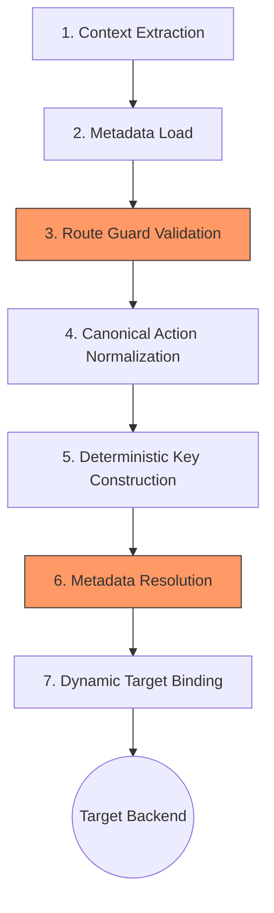

# FAQ – Routing Models: Traditional vs GDCR/DCRP

### Q1 – What is the common routing model in many enterprise landscapes?

The dominant pattern in many integration landscapes is **system-oriented routing**. It establishes a direct and rigid relationship between an API Proxy and a specific backend system.

#### Typical Characteristics
* **One Proxy per Backend:** Each new system requires a new artifact.
* **System-Encoded URLs:** (e.g., `/sap/fi/invoices`).
* **Static Mapping:** Target endpoints are hardcoded in the proxy.
* **High Maintenance:** Redeployment is required for backend changes.

#### Traditional Architecture (Conceptual Result)
* ❌ **Proxy Sprawl:** Mass proliferation of artifacts.
* ❌ **Tight Coupling:** URLs are bound to specific backends.
* ❌ **Low Reuse:** Limited semantic or cross-domain reuse.
* ❌ **Technical Governance:** Indexed by technical IDs rather than business value.

> [!NOTE]  
> The limitation is not the gateway's technical capability—it is the **architectural mapping model**.

```text
Client
  |
  +--> [Proxy: Salesforce_Orders]  --> CPI iFlow A --> Salesforce
  |
  +--> [Proxy: SAP_FI_Invoices]    --> CPI iFlow B --> SAP S/4HANA
  |
  +--> [Proxy: Workday_Employees]  --> CPI iFlow C --> Workday
Client
  |
  +--> [Proxy: Salesforce_Orders]  -> CPI iFlow A -> Salesforce
  |
  +--> [Proxy: SAP_FI_Invoices]   -> CPI iFlow B -> SAP S/4HANA
  |
  +--> [Proxy: Workday_Employees] -> CPI iFlow C -> Workday
```
Result:

Many proxies and packages.

Little reuse at the level of business semantics.

### Q2 – How does DDRC routing differ?

**DCRP (Domain-Centric Routing Pattern)** introduces a **Domain Façade** model with deterministic semantic routing. Instead of binding proxies to systems, it exposes stable domain façades where execution is resolved dynamically through metadata and the **DDCR** (Domain-Driven Centric Router) engine.

#### Key Differences

# DDCR – Deterministic 7-Stage Routing Lifecycle

The **Domain-Driven Centric Router (DDCR)** execution engine follows a strict, deterministic seven-stage lifecycle. This ensures that every request is processed with 100% predictability and zero fuzzy logic.

---

### Execution Flow Diagram


*This aligns directly with the **DDCR 7-stage deterministic lifecycle** defined in v6.0.*

### DDCR Stage 4: Canonical Action Normalization

This stage is the core of the **GDCR Deterministic Lifecycle**. It eliminates ambiguity by mapping 241 disparate HTTP/Business verbs into **15 Canonical Action Codes**.

---

### Normalization Logic (Examples)

The normalization engine processes the incoming HTTP Verb and Path Suffix to resolve the intent into a standardized code.

| Canonical Code | Logic / Intent | Example Input Verbs (from 241) |
| :--- | :--- | :--- |
| **`CRT`** | Create / Post | `post`, `create`, `add`, `new`, `insert` |
| **`RD1`** | Read Single Entity | `get` (with ID), `fetch`, `show`, `find` |
| **`RDA`** | Read All / List | `get` (no ID), `list`, `search`, `query` |
| **`UPD`** | Update / Replace | `put`, `update`, `replace`, `set` |
| **`UPP`** | Partial Update | `patch`, `modify`, `change` |
| **`DEL`** | Delete / Remove | `delete`, `remove`, `drop`, `cancel` |
| **`SYN`** | Synchronize | `sync`, `replicate`, `mirror` |
| **`PRC`** | Process / Execute | `execute`, `run`, `trigger`, `calculate` |
| **`CHK`** | Check / Validate | `check`, `validate`, `verify`, `test` |
| **`EXP`** | Export | `export`, `download`, `extract` |
| **`IMP`** | Import | `import`, `upload`, `bulk-load` |
| **`APP`** | Approve | `approve`, `authorize`, `sign` |
| **`REJ`** | Reject | `reject`, `deny`, `decline` |
| **`MSG`** | Messaging | `notify`, `publish`, `emit`, `broadcast` |
| **`INF`** | Information | `metadata`, `schema`, `version`, `status` |

---

### Why Normalization Matters
* **Deterministic Routing:** It ensures that `POST /invoice` and `PUT /invoice/new` (if incorrectly used) are mapped to a single, predictable business intent.
* **Security Guardrails:** You only need to define security policies for **15 codes**, rather than managing hundreds of individual endpoint/verb combinations.
* **Semantic Observability:** Logs reflect the **Action Code**, making it easy to monitor business operations (e.g., "How many `CRT` actions failed today?") across all domains.

```text

Client 
  |  
  |   POST /sales/orders/create/salesforce
  v
+---------------------------------------------+
|       SAP APIM: Sales Facade                |
|     Path: /sales/** / routing - /orders/**  |
+---------------------------------------------+
  |
  |  Logic:
  |  1. Parse: d/e/a/variant
  |  2. Build Key: dcrp:orders:c:sf
  |  3. KVM Lookup: Get Target URL
  |  4. JS Engine: Build Final URL
  v
+------------------------------------+
|    SAP CPI: /http/dcrp/orders/c    |
+------------------------------------+
  |
  v
[ Service Backend ]
```

Key points:

The façade is stable and domain‑oriented.

Routing uses metadata (KVM), not static proxy → endpoint mapping.

New vendors/variants are onboarded via KVM entries, not new proxies.

```text

| Feature        | Traditional Model           | DCRP / GDCR Model                 |
|---------------|----------------------------- |-----------------------------------|
| Focus         | System-oriented              | Domain-oriented                   |
| Routing       | Static (hardcoded)           | Dynamic (metadata / KVM-based)    |
| Onboarding    | New proxy deployment         | New KVM entry + shared JS engine  |
| Scalability   | Low (proxy sprawl)           | High (metadata-driven)            |
| URL Stability | Changes with backend systems | Stable, business-centric interface|
```

---
### Q3 – How does GDCR handle multiple vendors and regions?

GDCR uses the `{variant}` segment to support different vendors, regions, or deployment stages without modifying proxy artifacts.

#### Example URL Structure & Key Resolution

Consumers call logical, business‑centric URLs that include the variant:

```text
/sales/orders/create/salesforce      <-- Global instance
/sales/orders/create/salesforceus    <-- USA region
/sales/orders/create/salesforceemea  <-- Europe region
```
### 2. KVM Key Resolution (“Truth Table”)

The routing engine normalizes the request into a KVM key that maps business intent to a concrete backend endpoint.

| Business Intent (URL)                      | Generated KVM Key        | Target Value (CPI / Backend)    |
|-------------------------------------------|--------------------------|--------------------------------- |
| `/sales/orders/create/salesforce`         | `sales:orders:c:sf`      | `http://cpi/orders/global`       |
| `/sales/orders/create/salesforceus`       | `sales:orders:c:sfus`    | `http://cpi/orders/usa`          |
| `/sales/orders/create/salesforceemea`     | `sales:orders:c:sfemea`  | `http://cpi/orders/emea`         |

The **DDCR engine** normalizes the incoming request into a **canonical key**, which is then used to retrieve the execution target from the control-plane metadata.

-----------------------------------

# ⚖️ Attribution & Framework Identity

> **GDCR Framework** · 2026 · ✍️ [Ricardo Luz Holanda Viana](https://orcid.org/0009-0009-9549-5862) · 🔗 [DOI: 10.5281/zenodo.xxxxx](https://doi.org/10.5281/zenodo.xxxxx) · ⚖️ [CC BY 4.0](https://creativecommons.org/licenses/by/4.0/)

This framework is an original architectural work. For academic, technical, or professional citations, please use the metadata provided above. For commercial inquiries, contact the author directly via ORCID/LinkedIn.

This document is part of the **Gateway Domain‑Centric Routing (GDCR)** framework and represents original architectural work authored by Ricardo Luz Holanda Viana. Reuse, adaptation, and distribution are permitted only with proper attribution. Any derivative or equivalent architectural implementation must reference the original work and associated DOI.

-----------------------------------
