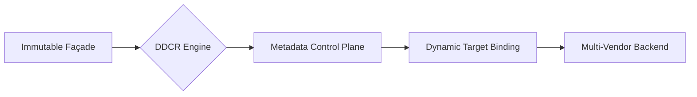

# FAQ 04 — GDCR Routing Model

This document defines the **Gateway Domain-Centric Routing (GDCR)** model, detailing its flow, properties, and architectural positioning.

---

## The Execution Model

The GDCR model shifts the gateway from a static proxy to a dynamic, semantic router governed by a control plane.

```text
  [ CLIENT ]
      |
      v
  [ SEMANTIC URL ] 
      | (e.g., /finance/invoice/v1/us)
      v
  [ GATEWAY (DCRP FAÇADE) ]
      |
      v
  [ DDCR ENGINE ] <--- (Deterministic Lifecycle)
      |
      v
  [ METADATA CONTROL PLANE ] <--- (KVM / Redis / DB)
      |
      v
  [ EXECUTION TARGET ] <--- (CPI / Backend / Service)
```

# Core Architectural Properties

The **GDCR Framework** is defined by seven primary properties that ensure linear scalability and robust governance across enterprise landscapes:

1. **Domain-Based Routing** Routing is indexed by business domain (e.g., Finance, HR), not technical system identity.
2. **Canonical Action Normalization** 241 action variants (verbs/paths) are normalized into **15 deterministic codes**.
3. **Deterministic Key Grammar** Every routing key is constructed from normalized semantic components, ensuring zero ambiguity.
4. **Control-Plane-Only Evolution** Backend changes (URL shifts, migrations) require metadata updates, **not** proxy modifications.
5. **Fail-Fast Validation** Unregistered combinations or unauthorized entities terminate immediately at the gateway boundary.
6. **Metadata-Driven Scalability** Scaling occurs through control-plane expansion rather than artifact multiplication (**Proxy Sprawl**).
7. **No Proxy Redeployment for Onboarding** New vendors, regions, or versions are introduced via metadata entries only.

---

## Architectural Positioning

GDCR does not redefine the gateway's technical capabilities; it formalizes the gateway as a **semantic router** with a deterministic execution grammar.



-----------------------------------

### ⚖️ Attribution & Framework Identity

> **GDCR Framework** · 2026 · ✍️ [Ricardo Luz Holanda Viana](https://orcid.org/0009-0009-9549-5862) · 🔗 [DOI: 10.5281/zenodo.xxxxx](https://doi.org/10.5281/zenodo.xxxxx) · ⚖️ [CC BY 4.0](https://creativecommons.org/licenses/by/4.0/)

This framework is an original architectural work. For academic, technical, or professional citations, please use the metadata provided above. Reuse, adaptation, and distribution are permitted provided that proper attribution to the original author and DOI is maintained.

-----------------------------------
