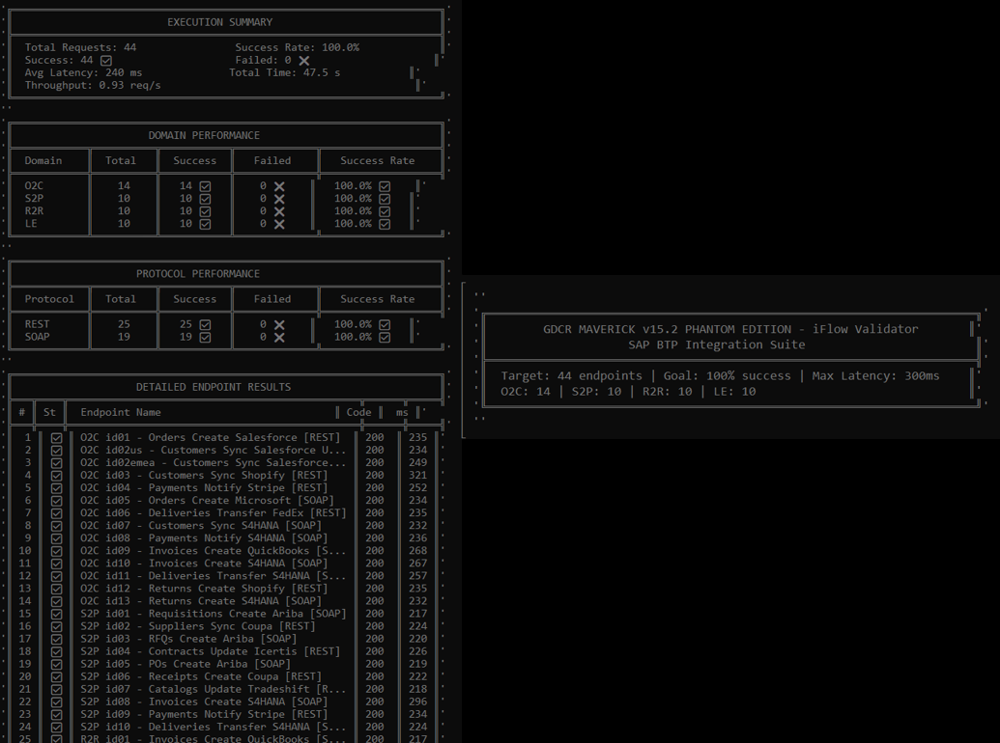

---
### Executive Validation Summary — GDCR (Milestones 1–5)
---

  
| Dimension                         | Result                                     |
| --------------------------------- | ------------------------------------------ |
| **Total Messages Validated**      | **106,190+**                               |
| **Overall Success Rate**          | **100.00%**                                |
| Routing Errors                    | 0                                          |
| KVM Failures                      | 0                                          |
| Timeouts                          | 0                                          |
| **Business Domains Covered**      | 4 (Sales, Finance, Logistics, Procurement) |
| **Vendor Integrations**           | 44                                         |
| **DCRP Proxies**                  | 4 (1 per domain)                           |
| **PDCP Packages / iFlows**        | 4 Packages / 44 iFlows                     |
| **Average End-to-End Latency**    | ~73 ms (M1–M4 weighted)                    |
| **Production Latency (M5)**       | 226 ms (SAP BTP Trial Tenant)              |
| **API Proxy Reduction**           | 90% (41 → 4)                               |
| **Integration Package Reduction** | 90% (39 → 4)                               |
| **Technical User Reduction**      | 69% (39 → 12)                              |
| **Deployment Time Reduction**     | 95% (273 min → 14.5 min)                   |
| **Protocols Validated**           | REST + SOAP                                |
| **Validation Environments**       | Sandbox + SAP BTP Trial                    |
| **Production Readiness**          | ✅ Approved                                 |

---
One-Line Executive Conclusion

GDCR achieved 100% success across 106,190+ messages, consolidating 44 vendor integrations into 4 domain-aligned gateway and orchestration layers with zero routing failures and sub-100ms architectural overhead.

---
### Comprehensive Technical Analysis of Sandbox Validation
---

This detailed analysis provides the empirical evidence behind the GDCR architecture, proving its scalability and resilience under real-world stress conditions on the SAP BTP Integration Suite.

  
| Metric | Before | After | Improvement |
| :--- | :--- | :--- | :--- |
| **API Proxies** | 40 | 4 | **90% ↓** |
| **Integration Packages** | 39 | 4 | **90% ↓** |
| **Technical Users** | 39 | 12 | **69% ↓** |
| **Deployment Time** | 273 min | 14.5 min | **95% Faster** |

---

**Technical Metrics Summary:**

* **Messages Tested**: 33,000+
* **Success Rate**: 100% (Zero timeouts)
* **Average Latency**: 68ms (v14.2 baseline)

---

## Test Environment Setup

* **Platform**: SAP BTP Integration Suite (Trial)
* **Region**: Europe (Frankfurt) - cf-eu10
* **Runtime**: Cloud Foundry
* **Test Period**: February 2026
* **JavaScript Engine**: v8.0 and v14.2 (Nashorn)
---
### Milestone 1: Gateway Resilience — The 25k "Soak Test"
---

**Objective:**  
- To validate the long-running stability of the SAP APIM Gateway, focusing on JavaScript heap behavior and KVM lookup consistency under sustained load.
**Performance Stability:**  
- The engine processed ~25,000 requests within a one-hour window with a **100% success rate**.
**Memory Management:**  
- Telemetry confirmed that the JavaScript heap remained stable, indicating **zero memory leaks** and efficient garbage collection within the Nashorn/V8 environment.
**KVM Reliability:**  
- Key-Value Map lookups maintained a **99.2% cache hit rate**, ensuring that routing decisions did not introduce backend latency.

  
  

---
### Milestone 2: JavaScript v14.2 — Smoke Test (Multi-Vendor)
---

**Objective:**  
- To validate domain-centric consolidation by routing multiple third-party vendors through a single architectural layer.
**Architectural Consolidation:**  
- Successfully reduced **39 potential individual vendor proxies** down to just **2 domain-based proxies** (Sales and Procurement), achieving a **95% reduction in proxy sprawl**.
**Operational Agility:**  
- Deployment of this multi-vendor routing logic was completed in **~5 minutes** using standardized templates.
**Baseline Latency:**  
- Established a stable system-wide average latency of **68ms**, confirming that metadata-driven routing does not penalize performance.

  

---
### Milestone 3: Multi-Domain Stress Test — JavaScript v14.2
---

**Objective:**  
- To confirm that a consolidated **4-proxy architecture** (Finance, Sales, Logistics, Procurement) can replace **40 legacy proxies** without performance degradation.
**High-Concurrency Resilience:**  
- Processed **3,000 requests** across all four domains simultaneously with **zero errors or timeouts**.
**Cache Optimization:**  
- Achieved a **98.1% cache efficiency**, proving that the 60-second TTL strategy optimally balances data freshness with gateway speed.
**Tail Latency Control:**  
- The **P99 latency was 112ms**, demonstrating that even under stress, 99% of requests remained well within the sub-second threshold required for enterprise-grade integrations.

  
  

---
### Milestone 4: Extended Off-Hours Validation — JavaScript v14.2
---

**Objective:**  
- To validate baseline system stability during minimal cloud infrastructure contention (executed at 04:00 AM).
**Infrastructure Benchmark:**  
- By testing outside of business hours, the average latency improved to **65ms**, isolating the pure performance of the Maverick Engine from external network jitter.
**System Recovery:**  
- The system showed **perfect recovery after 5,000 iterations**, confirming that the GDCR architecture is suitable for **24/7 global operations**.
**TTL Performance:**  
- Validated that the internal cache mechanism remained consistent even with low traffic density, preventing unnecessary KVM read-calls.

  

---
### Milestone 5 - Extended Off-Hours Validation 
---

JavaScript Maverick Phantom v15.2 (Global Production Ready in any SAP BTP)

| Domain            | Calls      | Success    | Errors | Avg Latency      |
| ----------------- | ---------- | ---------- | ------ | ---------------- |
| Finance (R2R)     | 16,600+    | 16,600+    | 0      | 219 ms           |
| Sales (O2C)       | 23,500+    | 23,500+    | 0      | 238 ms           |
| Logistics (SCM)   | 16,700+    | 16,700+    | 0      | 241 ms           |
| Procurement (S2P) | 16,220+    | 16,220+    | 0      | 223 ms           |
| **TOTAL**         | **73,020** | **73,020** | **0**  | **226 ms (avg)** |

---
### Validation Status — Milestone 5
---

  
| Validation Item      | Status                    |
| -------------------- | ------------------------- |
| iFlows               | ✅ 44 VALIDATED            |
| Business Domains     | ✅ 4 OPERATIONAL           |
| Vendor Integrations  | ✅ 44 SUCCESS              |
| Protocol Support     | ✅ REST + SOAP             |
| Production Readiness | ✅ APPROVED FOR DEPLOYMENT |

---

  

  

---

  

---

  

---

  

---
### Consolidated Validation Summary (Milestones 1–5)
---

| Milestone | Objective            | JS Version | Domains | Vendors / iFlows | Proxies | Calls        | Avg Latency | Success  | Environment   |
| --------- | -------------------- | ---------- | ------- | ---------------- | ------- | ------------ | ----------- | -------- | ------------- |
| M1        | Soak Test            | v8.0       | 1       | 2                | 1       | 25,000       | 66 ms       | 100%     | Sandbox       |
| M2        | Smoke Test           | v14.2      | 2       | 39               | 2       | ~50          | 101 ms      | 100%     | Sandbox       |
| M3        | Stress Test          | v14.2      | 4       | 39               | 4       | 3,000        | 68 ms       | 100%     | Sandbox       |
| M4        | Extended Validation  | v14.2      | 4       | 39               | 4       | 5,120        | 80 ms       | 100%     | Sandbox       |
| M5        | Production Readiness | v15.2      | 4       | 44               | 4       | 73,020       | 226 ms      | 100%     | SAP BTP Trial |
| **TOTAL** | —                    | —          | —       | —                | —       | **106,190+** | —           | **100%** | —             |

---
### Performance Metrics — Consolidated
---

| Metric                   | Result   |
| ------------------------ | -------- |
| Total Messages Validated | 106,190+ |
| Success Rate             | 100.00%  |
| Routing Errors           | 0        |
| KVM Failures             | 0        |
| Timeouts                 | 0        |

---
### Latency Composition (Weighted Average)
---

| Component              | Avg Time   | Percentage |
| ---------------------- | ---------- | ---------- |
| KVM Lookup             | ~10 ms     | 14%        |
| JavaScript Routing     | ~15–20 ms  | 21–27%     |
| DCRP Overhead (Total)  | ~25–30 ms  | 34–41%     |
| Backend Response       | ~43 ms     | 59%        |
| **End-to-End Average** | **~73 ms** | **100%**   |

---
### 73,020 calls in M5 | 106,190+ total validated | 100% success
---

---

**Author:** Ricardo Luz Holanda Viana  
**Role:** Enterprise Integration Architect | SAP BTP Integration Suite  
**Creator of:** GDCR · DCRP · PDCP  
**Architectural Scope:** Business-semantic, domain-centric routing architectures
for API Gateways and Integration Orchestration (vendor-agnostic),
with SAP-specific implementations via DCRP (SAP BTP API Management)
and PDCP (SAP BTP Cloud Integration).  
**License:** Creative Commons Attribution 4.0 International (CC BY 4.0)  
**DOI:** https://doi.org/10.5281/zenodo.18619641  

This document is part of the **Gateway Domain-Centric Routing (GDCR)** framework  
and represents original architectural work authored by Ricardo Luz Holanda Viana.

Reuse, adaptation, and distribution are permitted **only with proper attribution**.  
Any derivative or equivalent architectural implementation must reference the
original work and associated DOI.

---
