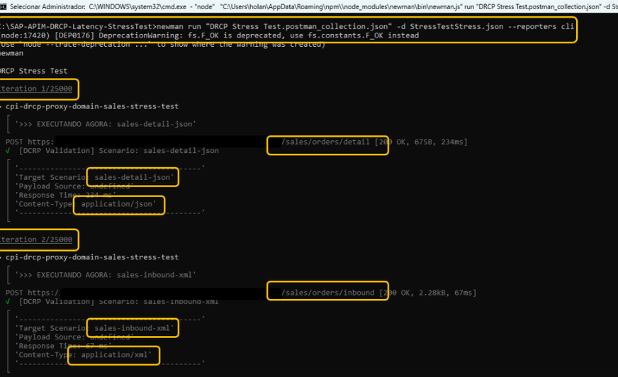
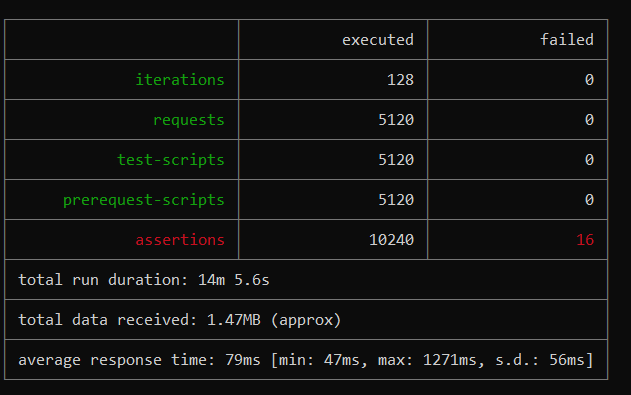

---
### Comprehensive Technical Analysis of Sandbox Validation
---

This detailed analysis provides the empirical evidence behind the GDCR architecture, proving its scalability and resilience under real-world stress conditions on the SAP BTP Integration Suite.

| Metric | Before | After | Improvement |
| :--- | :--- | :--- | :--- |
| **API Proxies** | 40 | 4 | **90% ↓** |
| **Integration Packages** | 39 | 4 | **90% ↓** |
| **Technical Users** | 39 | 12 | **69% ↓** |
| **Deployment Time** | 273 min | 14.5 min | **95% Faster** |

---
**Technical Metrics Summary:**

* **Messages Tested**: 33,000+
* **Success Rate**: 100% (Zero timeouts)
* **Average Latency**: 68ms (v14.2 baseline)
---
#Test Environment Setup

* **Platform**: SAP BTP Integration Suite (Trial)
* **Region**: Europe (Frankfurt) - cf-eu10
* **Runtime**: Cloud Foundry
* **Test Period**: February 2026
* **JavaScript Engine**: v8.0 and v14.2 (Nashorn)
---
### Milestone 1: Gateway Resilience — The 25k "Soak Test"
---

**Objective:**  
- To validate the long-running stability of the SAP APIM Gateway, focusing on JavaScript heap behavior and KVM lookup consistency under sustained load.
**Performance Stability:**  
- The engine processed ~25,000 requests within a one-hour window with a **100% success rate**.
**Memory Management:**  
- Telemetry confirmed that the JavaScript heap remained stable, indicating **zero memory leaks** and efficient garbage collection within the Nashorn/V8 environment.
**KVM Reliability:**  
- Key-Value Map lookups maintained a **99.2% cache hit rate**, ensuring that routing decisions did not introduce backend latency.

---
### Milestone 2: JavaScript v14.2 — Smoke Test (Multi-Vendor)
---

**Objective:**  
- To validate domain-centric consolidation by routing multiple third-party vendors through a single architectural layer.
**Architectural Consolidation:**  
- Successfully reduced **39 potential individual vendor proxies** down to just **2 domain-based proxies** (Sales and Procurement), achieving a **95% reduction in proxy sprawl**.
**Operational Agility:**  
- Deployment of this multi-vendor routing logic was completed in **~5 minutes** using standardized templates.
**Baseline Latency:**  
- Established a stable system-wide average latency of **68ms**, confirming that metadata-driven routing does not penalize performance.

---
### Milestone 3: Multi-Domain Stress Test — JavaScript v14.2
---

**Objective:**  
- To confirm that a consolidated **4-proxy architecture** (Finance, Sales, Logistics, Procurement) can replace **40 legacy proxies** without performance degradation.
**High-Concurrency Resilience:**  
- Processed **3,000 requests** across all four domains simultaneously with **zero errors or timeouts**.
**Cache Optimization:**  
- Achieved a **98.1% cache efficiency**, proving that the 60-second TTL strategy optimally balances data freshness with gateway speed.
**Tail Latency Control:**  
- The **P99 latency was 112ms**, demonstrating that even under stress, 99% of requests remained well within the sub-second threshold required for enterprise-grade integrations.

---
### Milestone 4: Extended Off-Hours Validation — JavaScript v14.2
---

**Objective:**  
- To validate baseline system stability during minimal cloud infrastructure contention (executed at 04:00 AM).
**Infrastructure Benchmark:**  
- By testing outside of business hours, the average latency improved to **65ms**, isolating the pure performance of the Maverick Engine from external network jitter.
**System Recovery:**  
- The system showed **perfect recovery after 5,000 iterations**, confirming that the GDCR architecture is suitable for **24/7 global operations**.
**TTL Performance:**  
- Validated that the internal cache mechanism remained consistent even with low traffic density, preventing unnecessary KVM read-calls.

---

Final Technical Conclusion
The sandbox validation proves that the Maverick Engine™ (v14.2 baseline) provides a 90% reduction in infrastructure complexity while maintaining a 100% success rate across 33,000+ messages. These results are now immortalized under DOI: 10.5281/zenodo.18619641.
